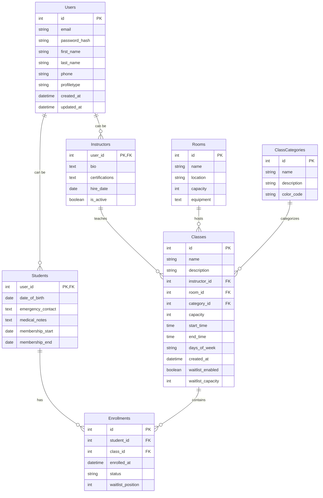

```mermaid
erDiagram
    Users {
        int id PK
        string email
        string password_hash
        string first_name
        string last_name
        string phone
        string profiletype
        datetime created_at
        datetime updated_at
    }

    Students {
        int user_id PK,FK
        date date_of_birth
        text emergency_contact
        text medical_notes
        date membership_start
        date membership_end
    }

    Instructors {
        int user_id PK,FK
        text bio
        text certifications
        date hire_date
        boolean is_active
    }

    ClassCategories {
        int id PK
        string name
        string description
        string color_code
    }

    Classes {
        int id PK
        string name
        string description
        int instructor_id FK
        int room_id FK
        int category_id FK
        int capacity
        time start_time
        time end_time
        string days_of_week
        datetime created_at
        boolean waitlist_enabled
        int waitlist_capacity
    }

    Rooms {
        int id PK
        string name
        string location
        int capacity
        text equipment
    }

    Enrollments {
        int id PK
        int student_id FK
        int class_id FK
        datetime enrolled_at
        string status
        int waitlist_position
    }

    Users ||--o{ Students : "can be"
    Users ||--o{ Instructors : "can be"
    Instructors ||--o{ Classes : teaches
    Rooms ||--o{ Classes : hosts
    Students ||--o{ Enrollments : has
    Classes ||--o{ Enrollments : contains
    ClassCategories ||--o{ Classes : categorizes
```
